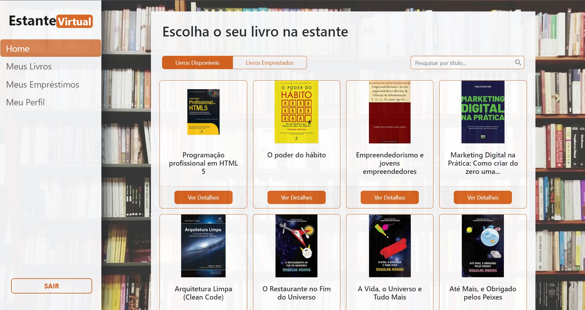

<h1 align="center">
  :books: Estante Virtual
</h1>

<p align="center">
  <a href="#pencil-objectives">Objectives</a>&nbsp;&nbsp;&nbsp;|&nbsp;&nbsp;&nbsp;
  <a href="#trophy-lessons-learned">Lessons Learned</a>&nbsp;&nbsp;&nbsp;|&nbsp;&nbsp;&nbsp;
  <a href="#rocket-technologies--resources">Technologies</a>&nbsp;&nbsp;&nbsp;|&nbsp;&nbsp;&nbsp;
  <a href="#hammer-setting-up-the-environment">Environment Setup</a>
</p>

<p align="center">
  

  

  

  

  
</p>



This application was proposed by [HeroSpark](https://herospark.com/), as part of their recruitment process for frontend developers. The challenge was to build a fully responsive client application using Vue, Vuex, Bootstrap and SASS to consume a simple REST API served by JSON-Server, with basic authentication, CRUD for books and search/filter mechanisms, abusing of creativity.

[Check out the application running!](https://estantevirtual.vercel.app/)

## :pencil: Objectives

- [x] Create a web application using Vue.js and Vuex JavaScript frameworks;
- [x] Use Bootstrap styles framework and integrate SASS;
- [x] Require basic authentication mechanism for user to navigate in the application;
- [x] Allow user to sign up, providing basic info like name, email and password;
- [x] Dispose of borrowed and loanable books, showing its name and a thumbnail;
- [x] Allow users to search for saved books;
- [x] Display book details and allowed actions - borrow, return, edit info (if it belongs to user);
- [x] Allow user to register new books to add to the bookshelf;
- [x] Dispose list of books user borrowed;
- [x] Dispose list of books user made available;
- [x] MUST have a responsive UI;
- [ ] Implement automated tests;

## :trophy: Lessons Learned

- Build and run a basic REST API using [JSON-Server](https://github.com/typicode/json-server);
- `async`/`await` syntax to handle asynchronous calls; :heartpulse:
- Structuring Vuex modules and functionalities;
- Use *guards* to access certain routes;
- Integrate SASS to a Vue project;
- Overwrite Bootstrap defaults and creating new themes using SASS/SCSS;
- Deploying a JSON-server application to **Heroku**;
- Deploying a Vue.js app to Vercel Serverless Cloud;

## :rocket: Technologies & Resources

**Frontend:**
- [Vue.js 2](https://vuejs.org)
- [Vuex 3](https://vuex.vuejs.org/)
- [VueRouter 3](https://router.vuejs.org/)
- [Axios](https://github.com/axios/axios) (HTTP client)
- [Bootstrap 4](https://getbootstrap.com/)

**Backend**
- [Node.js](https://nodejs.org/en/)
- [JSON-Server](https://github.com/typicode/json-server)
- [Heroku Cloud Server](https://heroku.com/) (for deployment)

**Development:**
- [Visual Studio Code](https://code.visualstudio.com/)
- [Cmder](https://cmder.net/) (terminal emulator)
- Vue-CLI and NPM scripts;

## :hammer: Setting up the Environment

Before running the application copy/rename file `.env.example` as `.env`. The existent value should work already, so no further configuration should be required. When building for production, however, you may want to add a `.env.production` and copy the same variables you have in `.env`, replacing the *localhost* reference to a valid address on the internet, where the API will be available (e.g.: https://estante-virtual.herokuapp.com).

Make sure to have **Node.js 10+** installed in your machine and its **npm** command available in terminal, then use the following routines:

```bash
$ npm install     # Download dependencies
$ npm start       # Run JSON-Server
$ npm run serve   # Run development server for front-end
$ npm run build   # Build files for production
```
